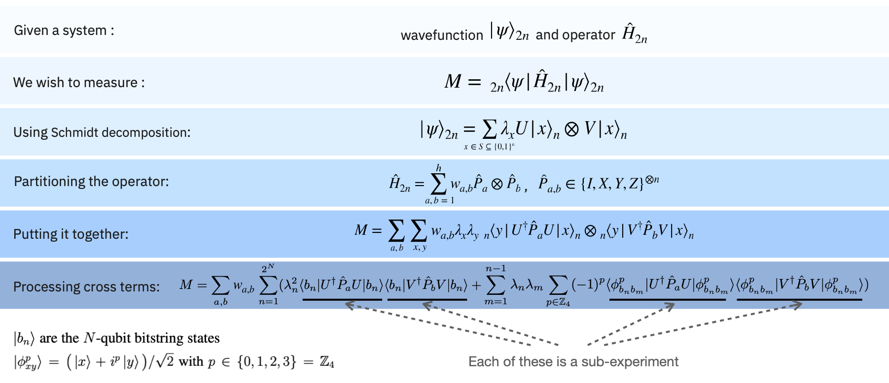

########################################################
Explanatory material for the entanglement forging module
########################################################

Overview of entanglement forging
--------------------------------

Entanglement forging [1] was introduced as a way to reduce the number of
qubits necessary to perform quantum simulation of chemical or physical
systems. In general, to simulate :math:`n` orbitals in a chemistry problem,
one typically needs :math:`2n` qubits. Entanglement Forging makes it
possible to represent expectation values of a :math:`2n`-qubit wavefunction
as sums of multiple expectation values of :math:`n`-qubit states, embedded in
a classical computation, thus doubling the size of the system that can
be *exactly* simulated with a fixed number of qubits. Furthermore,
Entanglement Forging permits the circuits necessary for the :math:`n`-qubit
simulations to be shallower, relaxing requirements on gate error and
connectivity, at the cost of increased quantum and classical run times.

Previous techniques for reducing qubit count in quantum simulation
applications could either reduce qubits slightly at the expense of
deeper circuits (e.g. 2-qubit reduction, tapering), or yield a 50% qubit
reduction at the expense of lower accuracy (e.g. restricted
simulations). Using Entanglement Forging, one can achieve a 50%
reduction in the number of qubits without compromising accuracy.

The underlying idea which enables Entanglement Forging is that a quantum
system on :math:`2n` qubits can be partitioned into 2 subsystems, and that a
Schmidt decomposition of the :math:`2n`-qubit wavefunction with respect to
those subsystems is possible. Because of this decomposition, we obtain
an accurate classical representation of the entanglement between the two
subsystems.

The schematic below outlines how the expectation value :math:`M` of a
:math:`2n`-qubit wavefunction :math:`\lvert \psi \rangle_{2n}`  with respect to a :math:`2n`-qubit
Hamiltonian :math:`H_{2n}` can be decomposed into a sum of expectation values
of products of :math:`n`-qubit wavefunctions with respect to :math:`n`-qubit
operators. These :math:`n`-qubit expectation values correspond to
sub-experiments.

   Entanglement Forging Infographic

Entanglement Forging Procedure
------------------------------

Entanglement Forging leverages near-term, heuristic algorithms, such as
VQE, to provide an estimate of the :math:`2n`-qubit expectation value. It
does so by assuming a parameterized ansatz for the wavefunction of each
sub-system. (Note that the parameters of this ansatz describe the
unitaries :math:`U` and :math:`V` in the Schmidt decomposition.) After the
expectation value :math:`M` has been decomposed into sub-experiments, the
procedure is as follows:

1. Execute each sub-experiment on the QPU a number of times necessary
   to obtain sufficient statistics.
2. Combine the expectation values for the sub-experiments with the
   weights :math:`w_{a,b}` and the Schmidt parameters :math:`λ_n` to
   obtain an estimate for :math:`M`.
3. Send the estimate of :math:`M`, along with :math:`λ_n` and the
   variational parameters :math:`\{θ\}` describing :math:`U` and
   :math:`V`, to a classical optimizer.
4. Use the classical optimizer to further minimize :math:`M` and
   provide a new set for the variational parameters :math:`\{θ\}` and
   Schmidt coefficients :math:`λ_n`.
5. Update the sub-experiments based on the updated :math:`\{θ\}` and
   :math:`λ_n`.
6. Repeat Steps 1-5 until the estimate for :math:`M` converges.

Note that if :math:`M` is the expectation value of the system’s Hamiltonian,
then it is possible to separate the optimization over the variational
parameters :math:`\{θ\}` and the Schmidt coefficients :math:`λ_n`. In particular, the
Schmidt coefficients can be optimized after step 2, and separately from
the variational parameters.

Further, an easy way to reduce the number of sub-experiments necessary
is by truncating the Schmidt decomposition of :math:`\lvert\psi\rangle` to include only some
number of the bitstring states :math:`\lvert b_n \rangle`. However, doing so will
generally lead to less accuracy in the estimation of the expectation
value.

Scaling
-------

The execution time scales differently with various properties of the
simulations, and is indicated in the table below.

+---------------+---------------------+---------------+---------------+
| Quantity      | Scaling             | Notes         | Ways to       |
|               |                     |               | Reduce        |
+===============+=====================+===============+===============+
| Orbitals      | Fifth power         |               | :ref:`Orbital |
|               |                     |               | freezing      |
|               |                     |               | <Freezing     |
|               |                     |               | orbitals>`    |
+---------------+---------------------+---------------+---------------+
| Bitstring     | Quadratic           | Increasing    | :ref:`Schmidt |
| states        |                     | the number of | decomposition |
| :math:`\lvert |                     | bitstring     | truncation    |
| b_n \rangle`  |                     | states can    | <picking the  |
|               |                     | increase the  | bitstrings>`  |
|               |                     | accuracy of   |               |
|               |                     | the           |               |
|               |                     | simulation,   |               |
|               |                     | but at the    |               |
|               |                     | expense of    |               |
|               |                     | execution     |               |
|               |                     | time.         |               |
+---------------+---------------------+---------------+---------------+
| Ansatz        | Linear              | An increased  | :ref:`Redesign|
| parameters    |                     | number of     | the ansatz    |
| :math:`\{θ\}` |                     | ansatz        | <Ansatz       |
|               |                     | parameters    | design>`      |
|               |                     | can increase  |               |
|               |                     | the accuracy  |               |
|               |                     | of the        |               |
|               |                     | simulation,   |               |
|               |                     | but at the    |               |
|               |                     | expense of    |               |
|               |                     | execution     |               |
|               |                     | time.         |               |
+---------------+---------------------+---------------+---------------+

.. _Freezing orbitals:

Freezing orbitals
~~~~~~~~~~~~~~~~~

Since the execution time scales with the 5th power in the number of
orbitals, it’s a good idea to simplify the problem (if possible) by
eliminating some of the orbitals. Some knowledge of chemistry is useful
when picking orbitals to freeze. One good rule of thumb is to freeze the
core orbital (for the case of water, this is the core oxygen 1s
orbital). Furthermore, in the case of water, it turns out that orbital 3
(corresponding to the out-of-plane oxygen 2p orbitals) has different
symmetry to the other orbitals, so excitations to orbital 3 are
suppressed. For water, we thus freeze orbitals 0 and 3.

Example: Water molecule
^^^^^^^^^^^^^^^^^^^^^^^

The total number of orbitals (core + valence) = 7 orbitals

Frozen orbital approximation = 2 orbitals

Active space orbitals = total number of orbitals – frozen orbitals = 5
orbitals (bitstring size is set to 5)

Leading excitation analysis = 3 unique bitstrings

.. code:: python

    >>> from circuit_knitting.utils import reduce_bitstrings
    >>> orbitals_to_reduce = [0,3]
    >>> bitstrings = [(1,1,1,1,1,0,0), (1,0,1,1,1,0,1), (1,0,1,1,1,1,0)]
    >>> reduced_bitstrings = reduce_bitstrings(bitstrings, orbitals_to_reduce)
    >>> print(f'Bitstrings after orbital reduction: {reduced_bitstrings}')
    Bitstrings after orbital reduction: [[1, 1, 1, 0, 0], [0, 1, 1, 0, 1], [0, 1, 1, 1, 0]]

A complete example is provided in the `guide on freezing orbitals <../how-tos/freeze-orbitals.ipynb>`_.

.. _Picking the bitstrings:

Picking the bitstrings
~~~~~~~~~~~~~~~~~~~~~~

General Considerations
^^^^^^^^^^^^^^^^^^^^^^

Picking appropriate bitstrings requires prior knowledge of the molecular
electronic structure.

In general, the exact electronic wavefunction is a superposition of all
possible distributions of the :math:`N` electrons over the :math:`L`
orbitals and is exponential in size. However, only a relatively small
number of excitations contribute significantly to the correlation
energy. By identifying such leading electronic excitations, a linear
combination of electronic configurations/Slater determinants that
capture the most important portion of the Hilbert space and make the
biggest contribution to the electronic wavefunction description can be
selected. This allows for reduction in computational resources.

The leading electronic excitations can be represented in standard
bitstrings (e.g. ``[1,1,1,1,0,0,0]``). When an orbital is occupied by a
spin up (α electron) or spin down (β electron), its bit will be set to
1. Therefore:

- the number of bits in each bitstring should be equal the
  number of spatial orbitals
- the number of 1s in each bitstring should
  equal the number of α or β particles.

Further reduction in computational resources can be achieved by
:ref:`freezing some orbitals <Freezing orbitals>`
that do not participate in electronic excitations (i.e. core orbitals or
those that lie out of symmetry) by removing the bits that correspond to
them.

.. _Fixing the Hartree-Fock bitstring:

Fixing the Hartree-Fock bitstring
^^^^^^^^^^^^^^^^^^^^^^^^^^^^^^^^^

In some cases, it is possible to increase the accuracy of simulations and speed up
the execution by bypassing the experiments associated with the first bitstring and
replacing those results with the Hartree-Fock energy value.

.. code-block:: python
   :caption: Fixing the HF energy at each iteration
       from qiskit_nature.second_q.problems import ElectronicStructureProblem
       from circuit_knitting.forging import EntanglementForgingGroundStateSolver

       problem = ElectronicStructureProblem(...)
       hf_energy = ...

       solver = EntanglementForgingGroundStateSolver(
           ansatz=ansatz,
           hf_energy=hf_energy
       )

       result = solver.solve(problem)

This setting requires an ansatz that leaves the Hartree-Fock (HF) state
unchanged with respect to the optimization parameters. As a rule of thumb,
this can be achieved by restricting entanglement between the qubits representing
occupied orbitals (bits = 1) in the HF state and the qubits representing
unoccupied orbitals (bits = 0) in the HF state.

For example, this figure from [1] shows the A, B, and C qubits entangled with
the hop gates, D & E qubits entangled with hop gates, while the partition between
(A,B,C) and (D,E) are only entangled with a CZ gate.

.. figure:: figs/fixed_hf.png
   :width: 250
   :alt: Fixing the first bitstring to the HF value

.. _Ansatz design:

Designing the ansatz used in Entanglement Forging
~~~~~~~~~~~~~~~~~~~~~~~~~~~~~~~~~~~~~~~~~~~~~~~~~

Because entanglement forging leverages a near-term, heuristic algorithm
(namely, VQE), a judicious choice for the VQE ansatz can improve
performance. Note that one way to design the ansatz is by endowing the
unitaries :math:`U` and :math:`V` in the Schmidt decomposition with parameters. An
open question is how to choose the best unitaries for a given problem.

For a chemistry simulation problem, the number of qubits in the circuit
must equal the number of orbitals (minus the number of frozen orbitals,
if applicable).

⚠️ Current limitations
----------------------

Ansatz & bitstrings
~~~~~~~~~~~~~~~~~~~

-  It is currently an open problem how to pick the best circuit
   (ansatze) for VQE (and thus Entanglement Forging) for a given system.
-  It is also currently an open problem how to pick the best bitstring
   for Entanglement Forging.
-  In the current implementation of the module, the same ansatz circuit
   is used for both spin-up and spin-down systems, U and V.
-  In the current implementation of the module, the ansatz must be real.

   -  For molecular calculations, one can usually force the ansatz to be
      real. On the other hand, in crystalline solids (away from the
      gamma point and without inversion symmetry), the Hamiltonian is
      defined by the complex numbers.
   -  There are plans in the future to implement complex ansatze.

Results
~~~~~~~

-  In the current implementation, only the energy of the final state is
   available. It would be useful to have a feature to output the 1- and
   2-body density matrices of the final state after the optimization.

   -  The 1-body matrices are used for:

      -  electrostatic properties
      -  electronic densities
      -  molecular electrostatic potential

   -  2-body matrices are used for:

      -  orbital optimization
      -  analysis of correlation functions

   -  The combination of both is used in entanglement analysis.

Running on quantum hardware
~~~~~~~~~~~~~~~~~~~~~~~~~~~

Results on hardware will not be as good as on the QASM simulator.
Getting good results will require using a quantum backend with good
properties (qubit fidelity, gate fidelity etc.), as well as a lot of
fine-tuning of parameters.

Pauli grouping
~~~~~~~~~~~~~~

There is currently no Pauli grouping for the expectation value experiments
calculated at each iteration, so expectation values are calculated on the
full Pauli basis. This can result in long training times for larger systems.

References
----------

This module is based on the theory and experiment described in the
following paper:

[1] Andrew Eddins, Mario Motta, Tanvi P. Gujarati, Sergey Bravyi,
Antonio Mezzacapo, Charles Hadfield, Sarah Sheldon, *Doubling the size
of quantum simulators by entanglement forging*,
https://arxiv.org/abs/2104.10220
